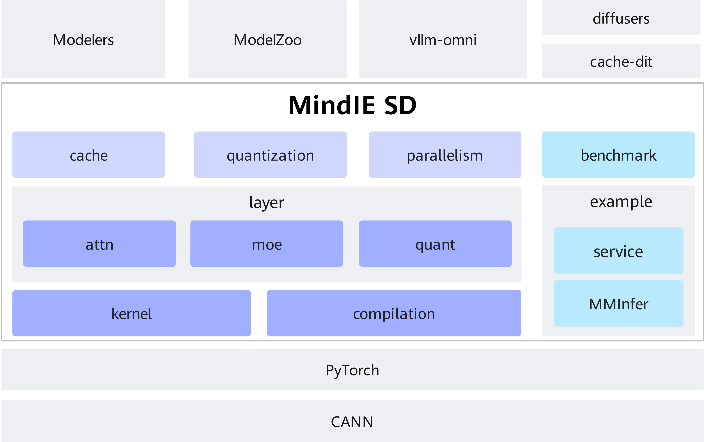

# 架构设计

## 架构目标

MindIE SD旨在构建昇腾亲和的多模态加速系列套件，配合业内模型套件（如：diffusers），实现多模态推理在昇腾上的效率。主要专注于提供多模态生成的关键算子和融合算子，配合的昇腾亲和量化/稀疏算法，以存代算，多卡并行等策略，实现对diffusers模型的快速迁移和昇腾加速，未来会进一步扩展到多模态理解，全模态等场景的加速。

设计上，各模块间独立解耦设计，可单独使用也可以叠加使用。业内本身存在类似Cache-dit， xDiT等加速手段， 其效果与cache模块和parallelism模块功能相似，存在方案选择的问题，但是MindIE SD中其他组件依旧可以单独与之叠加使用。但各组件都使用了monkey patch

**主要特性：**

- 昇腾亲和加速算子：提供昇腾亲和多模态的FA、MM、moe、quant类算子，以及融合算子，支持通过layer模块对外使用。详情请参见[计算优化加速特性](./features/others.md)。
- 量化稀疏能力：针对昇腾的数据类型和算力分布，提供亲和的算法组合，并通过quantization模块导入使用。详情请参见[轻量化算法加速特性](./features/sparse_quantization.md)。
- 以存代算：提供DiT module、DiT block、attn等多种粒度的cache算法，以支持不同的视图场景加速。详情请参见[以存代算加速特性](./features/cache.md)和[显存优化加速特性](./features/graphics_memory_optimization.md)。
- 多卡并行：提供CFG、USP等并行能力，融入加速算子的API中，实现接口替换后的自动使能。详情请参见[多卡并行加速特性](./features/parallelism.md)。
- 自动亲和加速：基于torch.compile的inductor机制，自定义融合pass，实现昇腾亲和算子替换。

>**说明：**  
>
>- 基于MindIE SD实现昇腾加速的diffusers模型发布在[Modelers](https://modelers.cn/models?name=MindIE&page=1&size=16)和[ModelZoo](https://www.hiascend.com/software/modelzoo)。
>对于相关但非本仓库聚焦的特性，在examples目录中提供了样例以供参考，例如，服务化部署样例请参考[服务化](../../examples/service)，多模态推理加速样例请参见[Cache](../../examples/cache)。

## 架构介绍

如下图所示，MindIE SD基于pytorch框架对外提供昇腾的加速能力，各加速能力支持独立使用，主要包含cache，parallelism，quantization，layer，kernel等模块。

MindIE SD的相关接口遵从diffusers的接口定义，部分基于MindIE SD实现昇腾加速的diffusers模型在[Modelers](https://modelers.cn/models?name=MindIE&page=1&size=16)/[ModelZoo](https://www.hiascend.com/software/modelzoo)中发布，也支持直接基于diffusers进行简单插件化改造。

**基础特性：**

- layer模块：提供基础对外的加速接口(包含attn，moe， quant等特性的layer)，是高阶特性的基础，本身可以单独使用。
- kernel模块：提供多模态生成相关的昇腾高性能kernel，支持AscendC和triton等编程语言的算子接入。
- compilation模块：基于fx graph的能力，开启compile后使能融合pass，实现昇腾自动亲和加速。

**高级特性：**

- quantization模块：支持量化能力的自动使能。
- cache模块：提供以存代算的加速能力的实现。
- parallelism模块：提供多卡并行的分布式加速能力，需要与layer模块和pytorch协同实现。
