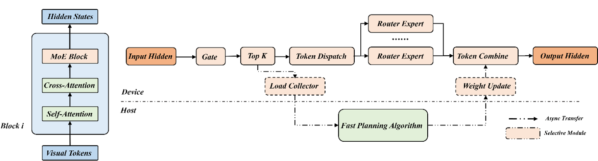

# 动态EPLB加速特性

## DyEPLB

- **背景**

  随着视觉生成模型向 DiT 架构演进，引入 MoE 机制以突破 Scaling Law 已成为行业共识。然而，DiT-MoE 庞大的参数规模迫使我们采用专家并行（EP）策略。与 LLM 不同，视觉数据的强空间局部性极易诱发特定专家过载，导致严重的计算负载不均。更进一步，扩散模型的去噪过程中专家激活分布呈现出显著的时序动态变化，这意味着传统的静态负载均衡策略在面对这种时空双重异构性时彻底失效。为此，我们面向DiT-MoE场景，构建了动态专家负载均衡的策略，以提升集群算力利用率，提高推理性能表现。

    
<br>

- **原理**

  通过负载信息动态调整 Rank 上的专家权重以达到专家负载均衡从而实现模型推理加速。
<br>

- **注意事项**

  - 由于DyEPLB方案是无侵入式的，对于全局同步点检查、权重更新的位置可根据模型具体实现方案和FPA算法场景自行选择
  - all_gather下的全量EP情况可以提前全局同步点检查适配自定义算子(如torch_npu.npu_moe_init_routing_v2)，从而达到替换权重时避免破坏token连续性的目的
  - 建议权重更新模块在两次Matmul之前，使得FPA算法收益最大化；由于涉及到H2D的数据传输，与offload方案同时使用时可能会存在带宽风险，需要自行调整两者执行时机避免相互阻塞；目前权重更新的过程中会无法避免的产生额外的专家权重显存占用，从而提高峰值显存，方案中FPA算法提供了EX模式降低专家布局改变规模解决。

<br>

- **适配流程**

  >[!NOTE]说明
  >为了最小程度的减少对主推理的影响，将算法和专家权重的拼接使用额外的线程和进程来处理。

  涉及到的接口输入输出说明请见 [类初始化及接口说明](#类初始化及接口说明)
  1. 执行以下命令启动EPLB算法进程。

     ```console
      root@node134:/home# python -m mindiesd.eplb.eplb_scheduler --world_size 2 --host localhost -- port 50001 --mode A2A
     ```

     部分启动参数解释如下所示：
     - world_size：EP数；
     - expert_num：全局专家数量；
     - block_num：moe层数；
     - max_move：EX模式下最大移动专家数量；
     - redundant：冗余专家数；
     - mode：A2A(all_to_all EP)、AG(all_gather EP)、EX(可控模式)；
     - auth_key：默认获取环境变量EPLB_AUTH_KEY，若未设置缺省secret_key。

  2. 引入负载采集器和调度器。

     ```python
     from mindiesd.eplb.dispatcher import DynamicDispatcher
     from mindiesd.eplb.collector import ExpertLoadCollector
     ```

  3. 模型推理前启动 worker 线程，以任务队列形式处理相关数据; 在模型初始化阶段后, 以moe layer为粒度同时初始化DyEPLB中的负载采集器和调度器

     ```python
     # 模型初始化
     model.init()

     # 负载采集器
     model.moe_module.block.expert_load_collector = ExpertLoadCollector(expert_num, lb_interval)
     # 调度器，持有Host侧完整专家权重
     model.moe_module.block.dispatcher = DynamicDispatcher(expert_num, weight1, weight2, rank_in_group, ep_size)
     # 启动 worker 线程
     if eplb_enabled:
        from mindiesd.eplb.task_manager import construct_expert_info_transfer_pool
        # multiprocessing 通信，auth_key需与EPLB算法进程一致
        construct_expert_info_transfer_pool(module=model, rank_in_group=rank_in_group, device=device, ip=host, port=port, auth_key=auth_key)

     # 推理流程
     model.forward()
     ```

  4. all_gather全量EP下的适配，需要额外进行变换矩阵与专家scores的matmul，从而避免后续手动调整token、idx等变量的顺序。

     ```python
     if EP_AG and self.dispatcher.update_flag:
         # 根据专家排序生成的变换矩阵 shape(global_expert_num * global_expert_num)
         expert_trans_tensor = self.dispatcher.get_expert_trans_tensor()
         trans_scores = torch.matmul(scores, expert_trans_tensor)
     ```

  5. moe中使能位置：init_routing > 负载采集 > 全局同步检查 > 权重替换 > GMM。

     ```python
     expanded_tokens, expanded_row_idx, expanded_indices = torch_npu.npu_moe_init_routing(tokens, row_idx, indices, tokens.shape[0])

     # 负载采集
     self.expert_load_collector.collect_expert_load(expanded_indices)
     # 全局同步检查
     self.dispatcher.check_consistency()
     # 校验同步状态
     if self.dispatcher.update_flag:
        weight1, weight2, local_expert_num, device_indices_map, local_expert_indices_map, local_expert_list = self.dispatcher.update_module_weight_and_map()
        self.weight1 = weight1
        self.weight2 = weight2
        self.local_expert_num = local_expert_num

     tokens = torch_npu.npu_grouped_matmul_finalize_routing()
     ```

## 类初始化及接口说明

- ExpertLoadCollector
  参数说明：
  - expert_num：全局专家数
  - lb_interval：EPLB间隔步数，默认为1即所有step都进行EPLB

  返回值：无
- DynamicDispatcher
  参数说明：
  - expert_num：全局专家数
  - weight1：UP权重
  - weight2：DOWN权重
  - rank_in_group：ep通信组组内编号
  - ep_size：ep数
  
  返回值：无
- construct_expert_info_transfer_pool
  参数说明：
  - module：初始化完成后的model
  - rank_in_group：ep通信组组内编号
  - device：rank对应的device编号
  - ip：与服务端配置的ip需一致
  - port：与服务端配置的port需一致
  - auth_key：multiprocess秘钥，默认读取环境变量EPLB_AUTH_KEY，未配置缺省为secret_key
  
  返回值：无
- get_expert_trans_tensor
  all_gather下的EP场景下使用，用于变换矩阵的获取
- collect_expert_load
  参数说明： 
  - expanded_indices：专家对应的token cumsum的值，可使用npu_moe_init_routing输出值作为输入
  
  返回值说明：无返回值
- check_consistency
  接口内部额外增加了一次all_gather通信，用于rank间同步状态的检查
- update_module_weight_and_map
  参数说明：无
  返回值说明： 
  - weight1：UP权重
  - weight2：DOWN权重
  - local_expert_num：本地专家个数，服务冗余专家情况
  - device_indices_map：例如[0, 1, 1, 0], 代表 index 号专家属于的rank
  - local_expert_indices_map：例如rank0上[0, -1, -1, 1]，rank1上[-1, 0, 1, -1]，代表index号专家在本地专家权重的位置
  - local_expert_list：例如rank0上[0, 3]，rank1上[1, 2]，代表本地专家排布
