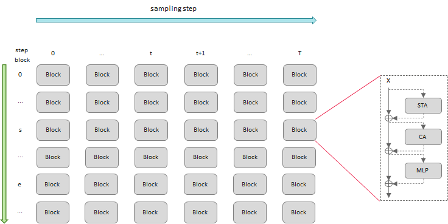
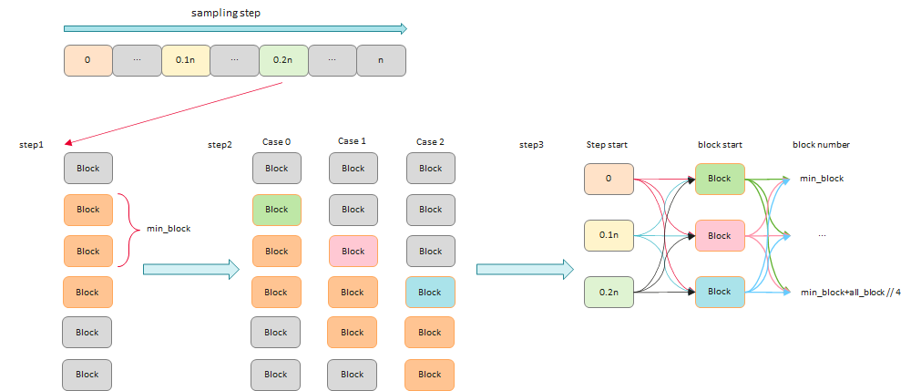
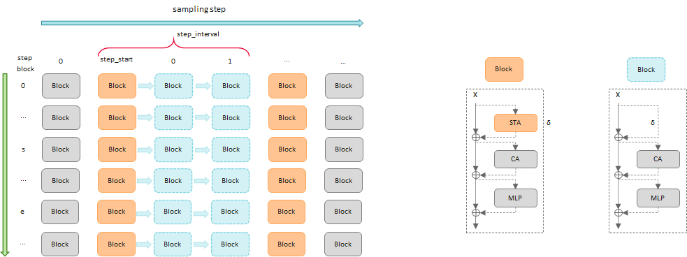
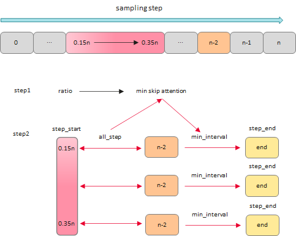

> 本章节主要介绍`以存代算`相关加速特性
> - [DitCache](#ditcache)
> - [AttentionCache](#attentioncache)
> - [时间步优化](#时间步优化)


## DitCache
- 背景：DiT模型在推理过程中会循环迭代T个步骤，每个步骤t都会完整的计算所有的block，而每个block都包含大量的计算操作（如图所示）。但相邻步骤之间的latent很相似，导致推理过程中反复计算几乎相同的中间结果，造成计算冗余，推理速度慢。

  

- 原理：基于相邻迭代采样步骤间、或相邻block间的激活相似性，复用模型局部特征，跳过指定的DiTBlock，减少冗余计算，实现模型推理加速。
- 优化方法：通过搜索脚本，根据加速比计算需要跳过的最少block数，然后从起止block开始遍历，在所有可能的组合中，找到MSE损失最小的配置作为最优解。其核心优化点在于：当缓存命中时，直接复用stepN中特定block区间的计算结果到stepM，从而将整个DiTBlock序列的正向传播计算变成一次简单的张量读取操作。

    
  - step1：根据加速比计算最小需要cache的block数； 
  - step2：在每个step中，由于block0需要计算，所以从block1开始遍历，通过计算找到最小的三组block start和block end； 
  - step3：遍历step2得到的所有可能的组合，计算模型cache前和cache后的MSE，找到MSE损失最小的配置作为最优解； 
  - step4：将上述步骤得到的参数配置在模型中，并在执行推理时开启cache完成加速。

- 优化流程：
  - 调用CacheConfig和CacheAgent接口。
    ```python
    from mindiesd import CacheConfig, CacheAgent
    ```
  - 在模型初始化的方法中初始化CacheConfig。
    ```python
    config = CacheConfig(
            method="dit_block_cache",
            blocks_count=len(transformer.single_blocks), # 使能cache的block的个数
            steps_count=args.infer_steps,                # 模型推理的总迭代步数
            step_start=args.cache_start_steps,           # 开始进行cache的步数索引
            step_interval=args.cache_interval,           # 强制重新计算的间隔步数
            step_end=args.infer_steps-1,                 # 停止cache的步数索引
            block_start=args.single_block_start,         # 每一步中，开始进行cache的block索引
            block_end=args.single_block_end              # 每一步中，停止cache的block索引
        )
    ```
  - 在Transformer的init方法中初始化cache变量
    ```python
    self.cache = None
    ```
  - 初始化CacheAgent并赋值给block。
    ```python
    cache_agent = CacheAgent(config)
    # 使能ditcache
    pipeline.transformer.cache = CacheAgent(cache_config)
    ```
  - 在Transformer的forward方法中使用apply方法使能cache进行推理，其中apply方法第一个入参为block，其余参数与原始代码保持一致
    ```python
    for index_block, block in enumerate(self.transformer_blocks):
      # 使能ditcache
      hidden_states, encoder_hidden_states = self.cache.apply(
          block,
          hidden_states=hidden_states,
          encoder_hidden_states=encoder_hidden_states,
          encoder_hidden_states_mask=encoder_hidden_states_mask,
          temb=temb,
          image_rotary_emb=image_rotary_emb,
          joint_attention_kwargs=attention_kwargs,
          txt_pad_len=txt_pad_len
      )
    ```

- 可执行示例参见examples下的[cache目录](../../examples/cache/cache.py)

---
## AttentionCache 

- 背景：模型在推理过程中会循环迭代T个步骤，每个步骤中包含多个block，而每个block都包含大量的计算操作，比如STA（如图所示）。但相邻步骤之间的block中的attention层比较相似，导致推理过程中反复计算几乎相同的中间结果，造成计算冗余，推理速度慢。

  

- 原理：基于相邻时间步的特性相似性，与DitCache不同，AttentionCache通过复用block里的Attention计算结果，从而跳过部分Attention层，减少冗余计算，实现模型推理加速。
- 优化方法：通过搜索脚本，根据加速比计算需要跳过的最小Attention次数，然后遍历起止step，在所有可能的组合中，找到MSE损失最小的配置作为最优解。其核心优化点在于：利用以空间换时间的原理，直接复用stepN的block的Attention层的计算缓存结果到stepM，显著减少Attention层的计算量。

    
  - step1：根据加速比ratio计算最小需要跳过的attention次数；
  - step2：根据开始step和min_skip_attention计算出min_interval与step_end，并遍历所有可能的结果，计算模型cache前和cache后的MSE，找到MSE损失最小的配置作为最优解；
  - step3：将上述步骤得到的参数配置在模型中，并在执行推理时开启cache完成加速。

- 优化流程：
  - 调用CacheConfig和CacheAgent接口。
    ```python
    from mindiesd import CacheConfig, CacheAgent
    ```
  - 初始化CacheConfig，对于attention\_cache、block\_start和block\_end，可采用默认值。
    ```python
    config = CacheConfig(
                method="attention_cache",
                blocks_count=len(transformer.transformer_blocks), # transformer模型包含的block个数
                steps_count=args.infer_steps,                # 模型推理的总迭代步数
                step_start=args.start_step,                  # 开始进行cache的步数索引
                step_interval=args.attentioncache_interval,  # 强制重新计算的间隔步数
                step_end=args.end_step                       # 停止cache的步数索引
            )
    ```
  - 在Transformer的block模块的init方法中初始化cache变量
    ```python
    self.cache = None
    ```
  - 初始化CacheAgent并赋值给block
    ```python
    cache_agent = CacheAgent(config)
    # 对block里的attention部分进行cache
    for block in transformer.transformer_blocks:
        block.cache = cache_agent
    ```
  - 在Transformer的block模块的forward方法中使用apply方法使能cache进行推理，其中方法第一个入参为原始执行推理的方法，其余参数与原代码保持一致
    ```python
    # 使能attention cache
    attn_output = self.cache.apply(
        self.attn,
        hidden_states=img_modulated,
        encoder_hidden_states=txt_modulated,
        encoder_hidden_states_mask=encoder_hidden_states_mask,
        image_rotary_emb=image_rotary_emb,
        **joint_attention_kwargs,
    )
    ```


---
#### 3. FAQ
> Q：Qwen-Image-Edit-2509在开启AttentionCache后推理报错：RuntimeError: NPU out of memory. 

A：开启AttentionCache会增加对显存的消耗，单卡显存容易不足，推荐使用八卡推理。

---
## 时间步优化
- 原理：通过减少、调整或跳过扩散模型去噪过程中的某些步骤，在尽量不损失精度的前提下，减少DitModule数量，避免冗余计算，实现模型推理加速。
- 优化方法：

    （1）修改timestep的数值：例如从50减少到20，从而提升推理速度。

    （2）Adastep采样：是一种自适应的、动态的时间步跳过算法。它的核心思想：在推理过程中实时评估latent当前状态，动态决定跳过step间差异较小的若干步，以达到快速收敛的目的。当前该方法仅在CogVideoX中使用，其他模型没有使用，被DiTCache、AttnCache替代。 
