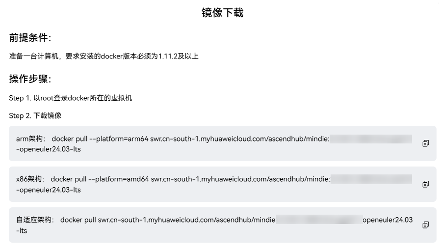

# 安装指导

本文档介绍 MindIE SD 在镜像环境和物理机环境中的安装准备流程。若希望直接跑通示例，可结合 [快速开始](quick_start.md) 一起阅读。

## 方式一：镜像安装方式

本章节指导开发者进行容器镜像安装。

1. 安装驱动固件。

    宿主机需要确保安装过NPU驱动和固件。如未安装，请参见[《CANN 软件安装指南》](https://www.hiascend.com/document/detail/zh/CANNCommunityEdition/850alpha002/softwareinst/instg/instg_quick.html?Mode=PmIns&OS=openEuler&Software=cannToolKit)中的“选择安装场景”章节或“选择安装场景”章节（社区版），根据安装方式、操作系统、业务场景选择安装场景，选择完成后单击“开始阅读”，按“安装NPU驱动和固件”章节进行安装。

   - 安装方式：选择“在物理机上安装”。
   - 操作系统：选择使用的操作系统，MindIE支持的操作系统请参考硬件配套和支持的操作系统。
   - 业务场景：选择“训练&推理&开发调试”。

    用户在宿主机自行安装Docker（版本要求大于或等于24.x.x）。配置源之前，请确保安装环境能够连接网络。

2. 获取MindIE容器镜像。

   - 单击[昇腾镜像仓库链接](https://www.hiascend.com/developer/ascendhub/detail/af85b724a7e5469ebd7ea13c3439d48f)，进入MindIE镜像下载页面。
   - 单击页面右上角登录按钮，使用华为账号登录（如果没有请先注册）。
   - 在MindIE镜像下载页面的“镜像版本”页签，根据您的设备形态，单击对应镜像后方“操作”栏中的“立即下载”按钮。
   - 根据弹出的镜像下载操作指导页面下载镜像，示例如图1所示。

   

3. 使用镜像。

    启动容器时，下表中配置项一般需要按实际环境自行修改。

    | 配置项 | 命令中的位置 | 说明 |
    | ------ | ------------ | ---- |
    | 容器名称 | `--name <container-name>`，以及 `docker exec` 中的 `<container-name>` | 替换为自定义容器名；进入容器时须与启动时 `--name` 一致。 |
    | 镜像名称 | 命令末尾 `mindie:2.2.RC1-800I-A2-py311-openeuler24.03-lts`（镜像名与标签） | 替换为本地已存在镜像的名称与标签，可通过 `docker images` 查看。 |
    | 挂载路径 | 各 `-v` 参数中**冒号左侧**的主机路径，例如 `/path-to-weights` | 按实际目录修改；昇腾驱动、固件等路径需与宿主机安装位置一致。 |
    
    执行以下命令启动容器（示例命令，请结合上表修改）：
    
    ```bash
    docker run -it -d --net=host --shm-size=1g \
        --name <container-name> \
        --device=/dev/davinci_manager:rwm \
        --device=/dev/hisi_hdc:rwm \
        --device=/dev/devmm_svm:rwm \
        --device=/dev/davinci0:rwm \
        -v /usr/local/Ascend/driver:/usr/local/Ascend/driver:ro \
        -v /usr/local/Ascend/firmware/:/usr/local/Ascend/firmware:ro \
        -v /usr/local/sbin:/usr/local/sbin:ro \
        -v /path-to-weights:/path-to-weights:ro \
        mindie:2.2.RC1-800I-A2-py311-openeuler24.03-lts bash
    ```

    > **说明：** 
    >“mindie:2.2.RC1-800I-A2-py311-openeuler24.03-lts”为镜像名称和标签，可根据实际情况修改。可在宿主机执行以下命令查看当前机器上已有的镜像：
    >
    >```bash
    >docker images
    >```
    >
    >对于--device参数，挂载权限设置为rwm，而非权限较小的rw或r，原因如下：
    >- 对于Atlas 800I A2 推理服务器，若设置挂载权限为rw，可以正常进入容器，同时也可以使用npu-smi命令查看npu占用信息，并正常运行MindIE业务；但如果挂载的npu（即对应挂载选项中的davincixxx，如npu0对应davinci0）上有其它任务占用，则使用npu-smi命令会打印报错，且无法运行MindIE任务（此时torch.npu.set_device()会失败）。
    >- 对于Atlas 800I A3 超节点服务器，若设置挂载权限为rw，进入容器后，使用npu-smi命令会打印报错，且无法运行MindIE任务（此时torch.npu.set_device()会失败）。

    执行以下命令进入容器。

    ```bash
    docker exec -it <container-name> bash
    ```

4. 安装其他环境所需依赖。

   1. 使用模型进行推理前需要安装对应的依赖，根据Modelers/Modelzoo仓上模型README，进行相关依赖的安装。以Wan2.1为例：

        ```bash
        git clone https://modelers.cn/MindIE/Wan2.1.git
        cd Wan2.1
        pip install -r requirements.txt
        ```

   2. 安装gcc、g++。

        若容器环境中没有gcc、g++，请用户自行安装，并导入头文件路径:
        
        ```bash
        yum install gcc g++ -y
        export CPLUS_INCLUDE_PATH=/usr/include/c++/12/:/usr/include/c++/12/aarch64-openEuler-linux/:$CPLUS_INCLUDE_PATH
        ```

## 方式二：物理机安装方式

本章节介绍如何在物理机上搭建完整的开发环境，包含驱动固件、CANN、PyTorch、Torch NPU、MindIE SD（安装包安装&源码编译）安装方式，以及MindIE SD卸载&更新方式。

1. 安装驱动固件。

    宿主机需要确保安装过NPU驱动和固件。如未安装，请参见[《CANN 软件安装指南》](https://www.hiascend.com/document/detail/zh/CANNCommunityEdition/850alpha002/softwareinst/instg/instg_quick.html?Mode=PmIns&OS=openEuler&Software=cannToolKit)中的“选择安装场景”章节或“选择安装场景”章节（社区版），根据安装方式、操作系统、业务场景选择安装场景，选择完成后单击“开始阅读”，按“安装NPU驱动和固件”章节进行安装。

   - 安装方式：选择“在物理机上安装”。
   - 操作系统：选择使用的操作系统，MindIE支持的操作系统请参考硬件配套和支持的操作系统。
   - 业务场景：选择“训练&推理&开发调试”。

   <br>

2. 安装CANN。

    需要安装的CANN软件包包括：CANN Toolkit开发套件包和CANN Kernels算子包。

    请参见[《CANN 软件安装指南》](https://www.hiascend.com/document/detail/zh/CANNCommunityEdition/850alpha002/softwareinst/instg/instg_quick.html?Mode=PmIns&OS=openEuler&Software=cannToolKit)中的“选择安装场景”章节或“选择安装场景”章节（社区版），根据安装方式、操作系统、业务场景选择安装场景，选择完成后单击“开始阅读”，按“安装CANN（物理机场景） > 安装CANN软件包”章节进行安装。

    - 安装方式：选择“在物理机上安装”。
    - 操作系统：选择使用的操作系统。
    - 业务场景：选择“训练&推理&开发调试”。

    <br>

3. 安装PyTorch和Torch NPU。

    需要安装的软件包包括：PyTorch框架whl包（支持版本为：2.1.0）和torch_npu插件whl包。

    - 请参见《Ascend Extension for PyTorch 软件安装指南》中的“[安装PyTorch](https://www.hiascend.com/document/detail/zh/Pytorch/720/configandinstg/instg/insg_0004.html)”章节安装PyTorch框架。
    - 请参见《Ascend Extension for PyTorch 软件安装指南》中的“[（可选）安装扩展模块](https://www.hiascend.com/document/detail/zh/Pytorch/720/configandinstg/instg/insg_0008.html)”章节安装torch_npu插件。

    > **说明：** 
    >若镜像环境中没有gcc、g++，请用户自行安装，并导入头文件路径。
    >
    >```bash
    >yum install gcc g++ -y
    >export CPLUS_INCLUDE_PATH=/usr/include/c++/12/:/usr/include/c++/12/aarch64-openEuler-linux/:$CPLUS_INCLUDE_PATH
    >```

    <br>

4. 安装其他环境依赖。

    使用模型进行推理前需要安装对应的依赖，根据Modelers/Modelzoo仓上模型README，进行相关依赖的安装。
   
    ```bash
    pip install -r requirements.txt
    ```

5. 安装MindIE SD。

    MindIE SD无需单独安装，安装MindIE时，MindIE SD将自动安装。MindIE软件包安装步骤如下：

      1. 将获取到的MindIE软件包上传到安装环境任意路径（如/home/package）进入软件包所在路径，增加对软件包的可执行权限
      
            ```bash
            cd /home/package
            chmod +x Ascend-mindie_<version>_linux-<arch>_<abi>.run
            ```

      2. 执行以下命令添加ascend-toolkit包的环境变量（以root用户为例，以下为root用户的默认安装路径）
      
            ```bash
            source /usr/local/Ascend/ascend-toolkit/set_env.sh
            ```

      3. 执行以下命令安装软件（以下命令支持--install-path={path}等参数，具体参数说明请参见软件包参数说明）
      
            ```bash
            ./软件包名.run --install --quiet
            ```

      4. 输入命令验证是否安装成功
      
            ```bash
            python3 -c "import torch, torch_npu, mindiesd; print(torch_npu.npu.is_available())"
            ```
